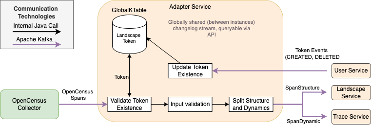

[](https://git.se.informatik.uni-kiel.de/ExplorViz/code/adapter-service/-/commits/master) 

[](https://git.se.informatik.uni-kiel.de/ExplorViz/code/adapter-service/-/commits/master)

# ExplorViz Adapter-Service

The entry point to ExplorViz that validates and preprocesses all incoming raw spans.

## Features



At its core, the Adapter-Service is a Kafka Streams application that steadily processes every span emitted by a monitored application.
All monitoring data of a instrumented application is send by the InspectIT Ocelot Agent via gRPC to the OpenCensus Collector, which in turn forwards all spans to this service via Kafka.
In essence, the Adapter-Service performs three steps on each span.

1. **Token validation**: 
   Prior to monitoring any application, the client has to request a unique identifier for the landscape, the so-called *landscape token*, at the User-Service.
   All spans of each application have to contain the landscape token that was given to the user for that particular landscape.
   To this end, the user needs to specify the token within the instrumentation configuration of the applications. 
   
   Whenever a landscape token is created/deleted/updated, the event gets broadcasted via Kafka.
   The Adapter-Service uses these events to keep track of all existing tokens in a Redis database. 
   If a span's token is missing, unknown, or invalid, the span gets discarded.
2. **Input Validation**: 
   If the token is valid, all other attributes of the span get validated, too. 
   If any non-optional attribute is missing or invalid, the span is discarded. 
   This step is essential as all downstream services assume that incoming data is syntactically valid.
3. **Splitting Spans**: 
   The information contained in a span can be divided into two parts. 
   One part containing data referring to the structural composition of the observed landscape (hostnames, applications, package structures, ...),
   and one containing runtime information of interactions between different entities within the landscape (call hierarchies, timings, ...).
   In ExplorViz, the former part is called *structure* and the latter *dynamic* span data.
   The last step of the Adapter-Service is to split each span into its two parts and write them to different Kafka topics.
   They are subsequently procesed by the ExplorViz/landscape-service and ExplorViz/traces-service, respectively.


## Instruction

Make sure to run the [ExplorViz software stack](https://git.se.informatik.uni-kiel.de/ExplorViz/code/deployment) before starting the service.

## Running the application in dev mode

You can run your application in dev mode that enables live coding using:
```
./gradlew quarkusDev
```

## Packaging and running the application

The application can be packaged using `./gradlew quarkusBuild`.
It produces the `adapter-service-1.0-SNAPSHOT-runner.jar` file in the `build` directory.
Be aware that it’s not an _über-jar_ as the dependencies are copied into the `build/lib` directory.

The application is now runnable using `java -jar build/adapter-service-1.0-SNAPSHOT-runner.jar`.

If you want to build an _über-jar_, just add the `--uber-jar` option to the command line:
```
./gradlew quarkusBuild --uber-jar
```

### Docker
Follow the instructions in the comment section of the Dockerfiles to build Docker images.

## Creating a native executable

You can create a native executable using: `./gradlew build -Dquarkus.package.type=native`.

Or, if you don't have GraalVM installed, you can run the native executable build in a container using: `./gradlew build -Dquarkus.package.type=native -Dquarkus.native.container-build=true`.

You can then execute your native executable with: `./build/adapter-service-1.0-SNAPSHOT-runner`

If you want to learn more about building native executables, please consult https://quarkus.io/guides/gradle-tooling#building-a-native-executable.
